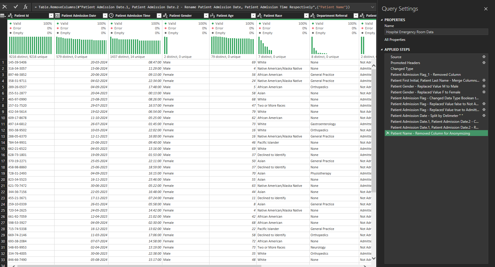
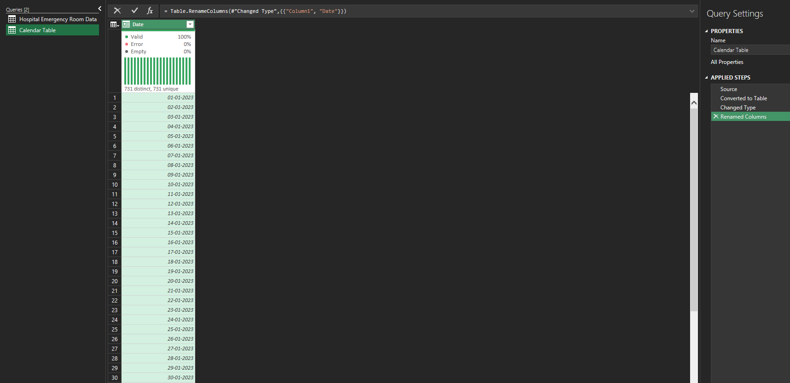
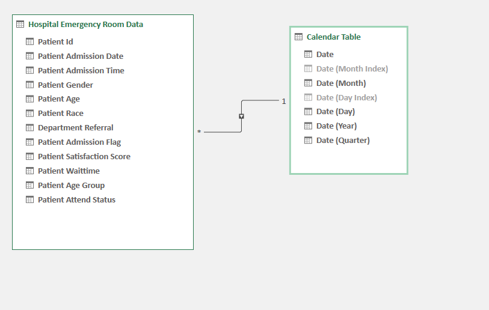
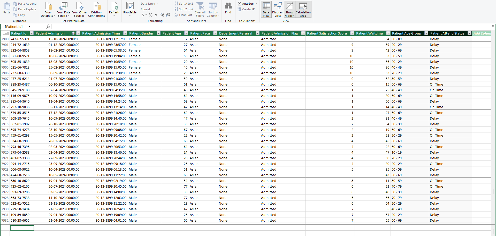
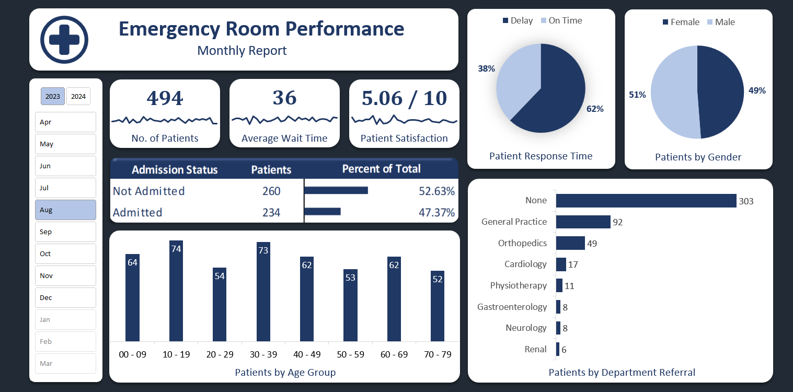
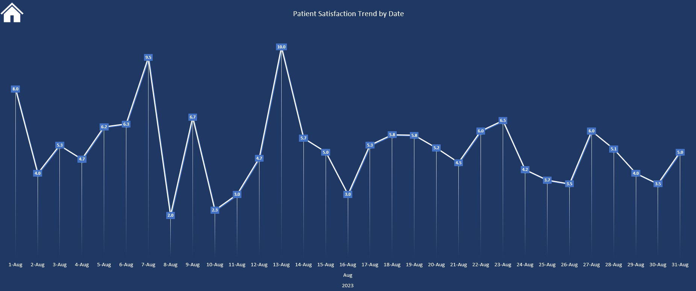
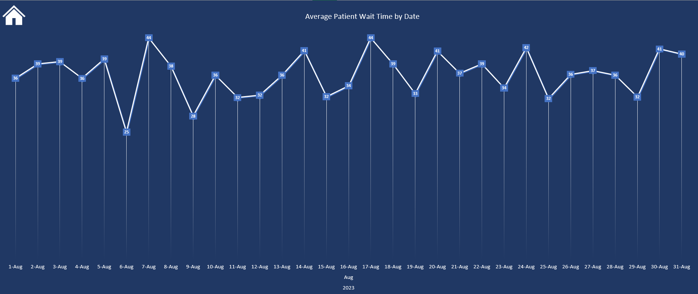
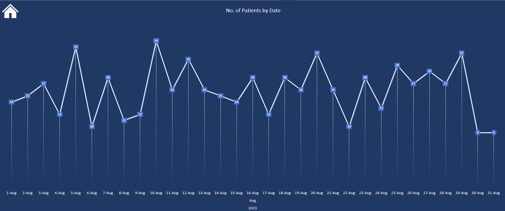

# Hospital Emergency Room Performance Dashboard

> **Excel | Power Query | Power Pivot | Data Modeling | Interactive Dashboard | Healthcare Analytics**

## Executive Summary

This project transforms raw hospital emergency-room records into an **interactive Excel analytics solution** for monitoring patient volume, admission outcomes, waiting time, satisfaction, demographics, and department referrals.

The objective was not simply to clean a dataset or build charts. The project was designed as a **decision-support dashboard** that allows an emergency-room manager to move from a high-level performance snapshot to operational patterns that can support further investigation.

The final solution combines:

- **Power Query** for data preparation and transformation
- **Power Pivot / Data Model** for analytical modeling
- A dedicated **Calendar Table** for time intelligence and date-based analysis
- Interactive **slicers and dashboard navigation**
- KPI cards and visual analysis for patient volume, waiting time, satisfaction, admission status, demographics, and referrals

### Key August 2023 Snapshot

The dashboard provides an example monthly view for **August 2023**, showing:

| KPI | Result |
|---|---:|
| Patients | **494** |
| Average Wait Time | **36** |
| Patient Satisfaction | **5.06 / 10** |
| Admitted Patients | **234 (47.37%)** |
| Not Admitted | **260 (52.63%)** |
| Delayed Response | **62%** |
| On-Time Response | **38%** |

These figures should be interpreted as **descriptive operational indicators**, not causal conclusions. For example, a high waiting time and lower satisfaction may coexist, but the dashboard alone does not establish that waiting time caused dissatisfaction.

---

# 1. Business Problem

Emergency departments need to balance patient demand, response time, admission decisions, and patient experience.

A raw transactional dataset makes it difficult for management to quickly answer questions such as:

- How many patients are visiting the emergency department?
- How does patient volume change over time?
- What is the average patient waiting time?
- Is the department meeting response-time expectations?
- How satisfied are patients?
- What proportion of patients are admitted?
- Which age groups account for the greatest patient volume?
- How are patients distributed by gender and race?
- Which departments generate the most referrals?
- Are operational indicators changing across dates or months?

This project converts those questions into an **interactive analytical reporting layer**.

---

# 2. Project Objectives

### Primary objective

Build a reusable Excel-based emergency-room performance reporting solution that enables stakeholders to monitor operational and patient-experience KPIs through interactive filtering.

### Analytical objectives

1. Measure emergency-room patient volume.
2. Monitor average patient waiting time.
3. Track patient satisfaction.
4. Analyze admission versus non-admission outcomes.
5. Examine response-time performance.
6. Understand patient demographics.
7. Identify referral patterns by department.
8. Analyze daily trends using a proper calendar dimension.
9. Create a structured data model rather than relying only on worksheet-level calculations.
10. Present the results through an executive-friendly dashboard.

---

# 3. Dataset & Analytical Fields

The main hospital emergency-room table contains fields including:

- Patient ID
- Patient Admission Date
- Patient Admission Time
- Patient Gender
- Patient Age
- Patient Race
- Department Referral
- Patient Admission Flag
- Patient Satisfaction Score
- Patient Waittime
- Patient Age Group
- Patient Attend Status

The original patient-name field was removed during transformation to support **anonymization and privacy-conscious reporting**.

---

# 4. Data Preparation with Power Query

Power Query was used as the ETL layer between the source data and the analytical model.

### Transformation workflow

The transformation process included:

- Promoting headers
- Correcting data types
- Standardizing gender values
- Converting admission flags into usable analytical values
- Splitting the admission date where required
- Recombining date components into a clean admission-date field
- Removing unnecessary / identifying fields
- Renaming fields for analytical readability
- Profiling columns for validity, errors, and empty values

The resulting dataset provides a cleaner and more consistent foundation for downstream analysis.

### Data-quality validation

The Power Query profiling view was used to verify:

- Valid records
- Errors
- Empty values
- Distinct values
- Data distributions

This is important because dashboard accuracy depends on the quality of the underlying transformation layer.

## Power Query Transformation



---

# 5. Calendar Table

A dedicated calendar table was created rather than relying solely on the transaction table's admission-date field.

The calendar contains:

- Date
- Month Index
- Month
- Day Index
- Day
- Year
- Quarter

The calendar spans **731 unique dates**, supporting consistent date filtering and chronological analysis.

This design makes the model more robust for:

- Daily trends
- Monthly analysis
- Year-level filtering
- Quarter analysis
- Time-based dashboard slicing

## Calendar Table



---

# 6. Data Model

The analytical model uses a relationship between:

**Calendar Table → Hospital Emergency Room Data**

The Calendar Table acts as the **one-side dimension**, while the emergency-room transaction table sits on the **many-side**.

This follows a dimensional modeling approach and prevents the dashboard from depending on manually maintained date logic.

## Data Model



---

# 7. Power Pivot / Data Model

Power Pivot provides the analytical layer for the dashboard.

The model separates:

- Transactional patient-level data
- Date dimension
- Analytical relationships
- Measures / aggregations used by reporting visuals

This allows the dashboard to respond dynamically when users change:

- Year
- Month
- Date
- Demographic selections
- Other report filters

## Power Pivot Model



---

# 8. Dashboard Architecture

The reporting solution is organized into multiple dashboard views rather than forcing every metric into a single page.

### Dashboard Home

The landing page provides the executive summary and key KPIs.

### Satisfaction Analysis

Focuses on patient satisfaction and its trend across dates.

### Wait-Time Analysis

Focuses on average patient waiting time and operational responsiveness.

### Patient Trend Analysis

Focuses on daily patient volume and demand fluctuations.

This structure lets a manager start with **"What is happening?"** and then move toward **"Where is the variation?"**

---

# 9. Executive Dashboard

The main dashboard provides an August 2023 performance snapshot with:

### KPI cards

- **494** patients
- **36** average wait time
- **5.06 / 10** patient satisfaction

### Admission status

- 234 admitted
- 260 not admitted
- 47.37% admitted
- 52.63% not admitted

### Response-time performance

- 62% delayed
- 38% on time

### Demographic distribution

- 49% female
- 51% male

### Patient age distribution

The dashboard breaks patients into age groups from:

- 00–09
- 10–19
- 20–29
- 30–39
- 40–49
- 50–59
- 60–69
- 70–79

### Department referrals

Referral volume is also displayed by department, allowing management to see where emergency-room patients are being referred.

## Dashboard Home



---

# 10. Patient Satisfaction Analysis

The satisfaction page tracks patient satisfaction across individual dates.

The daily trend demonstrates that satisfaction is **not stable across the month**.

For the displayed August 2023 trend:

- Highest observed daily satisfaction: **10.0**
- Lowest observed daily satisfaction: **2.0**
- Several dates fall in the mid-range, indicating meaningful day-to-day variation.

The key analytical opportunity is therefore not simply the monthly average. The **variation between dates** can help identify periods that warrant operational investigation.

> **Important analytical caution:** A daily satisfaction spike or decline should not automatically be attributed to staffing, waiting time, workload, or another operational factor without additional evidence.

## Satisfaction Trend



---

# 11. Patient Wait-Time Analysis

The wait-time view tracks average patient waiting time by date.

For the displayed August 2023 period, daily average waiting time ranges approximately from:

- **25** at the lowest observed point
- **44** at the highest observed point

The pattern shows substantial day-to-day fluctuation rather than a perfectly stable operating level.

This creates an opportunity for management to investigate:

- High-wait days
- Low-wait days
- Whether high-wait days coincide with higher patient volumes
- Whether response-time performance deteriorates under higher demand
- Whether patient satisfaction changes alongside wait time

The dashboard provides the descriptive evidence; additional analysis would be required to establish relationships between these variables.

## Wait-Time Trend



---

# 12. Patient Volume Trend

The patient-trend page tracks the number of patients by date.

For the displayed August 2023 period:

- Highest observed daily volume: **24 patients**
- Lowest observed daily volume: **9 patients**

The variation indicates that demand is uneven across days.

This type of view can support further operational questions around:

- Staffing requirements
- Capacity planning
- Peak-demand periods
- Resource allocation
- Relationship between volume and waiting time

## Patient Volume Trend



---

# 13. Operational Insights from the Dashboard

The dashboard is most useful when the metrics are considered together rather than independently.

### 1. Response-time performance requires attention

The August snapshot shows **62% delayed versus 38% on time**.

This indicates that delayed response is more common than on-time response in the selected period. That makes response-time performance a clear operational metric to investigate.

### 2. Patient experience is moderate rather than strong

The August patient satisfaction score is **5.06 / 10**.

A score around the midpoint suggests that there is meaningful room to improve patient experience, although the underlying causes cannot be determined from the dashboard alone.

### 3. Patient demand fluctuates materially

Daily patient volume varies from **9 to 24** in the displayed month.

This matters because a static staffing model may not be equally efficient across all days.

### 4. Waiting time is volatile

Daily average waiting time ranges from approximately **25 to 44**.

The variation is operationally more informative than the monthly average alone because it highlights specific periods for investigation.

### 5. Admission decisions are relatively balanced

The August snapshot shows:

- **47.37% admitted**
- **52.63% not admitted**

This indicates that slightly more than half of the patients were not admitted during the selected period.

### 6. Referral demand is concentrated

The dashboard shows that **None** is the largest referral category, followed by **General Practice** and **Orthopedics**.

This concentration can help prioritize further analysis of referral pathways and downstream capacity.

---

# 14. Dashboard Pages

## Page 1 — Executive Overview

High-level view of:

- Patient volume
- Average waiting time
- Patient satisfaction
- Admission status
- Response-time status
- Gender distribution
- Age distribution
- Department referral distribution


---

## Page 2 — Patient Satisfaction

Daily patient satisfaction trend across the selected period.


---

## Page 3 — Average Wait Time

Daily average patient waiting time trend.


---

## Page 4 — Patient Volume Trend

Daily number of patients arriving at the emergency department.


---

# 15. Technical Workflow

```text
Raw Hospital Data
       │
       ▼
Power Query
       │
       ├── Data Type Correction
       ├── Value Standardization
       ├── Date Transformation
       ├── Data Profiling
       └── Anonymization
       │
       ▼
Clean Hospital Emergency Room Table
       │
       ├───────────────┐
       ▼               ▼
Calendar Table     Power Pivot
       │               │
       └───────┬───────┘
               ▼
        Analytical Model
               │
               ▼
      Interactive Dashboard
               │
               ├── Executive KPIs
               ├── Satisfaction
               ├── Wait Time
               └── Patient Volume
```

---

# 16. Tools & Skills Demonstrated

### Microsoft Excel

- Advanced dashboard design
- Pivot-based reporting
- Interactive slicers
- KPI visualization
- Data modeling
- Executive reporting

### Power Query

- ETL / data transformation
- Data cleansing
- Data-type management
- Value standardization
- Date transformation
- Data profiling
- Privacy-conscious field removal

### Power Pivot

- Relational data modeling
- Dimension/fact-style structure
- Calendar table implementation
- Relationship management
- Analytical aggregation

### Data Analytics

- KPI development
- Trend analysis
- Operational performance analysis
- Patient-experience analysis
- Demographic analysis
- Referral analysis
- Business-oriented storytelling

---

# 17. Business Value

The value of the project is the transition from **raw patient records to an interactive management view**.

Instead of requiring a stakeholder to inspect thousands of rows, the dashboard surfaces the most important operational signals immediately:

**Demand → Response → Experience → Outcome**

This enables a manager to identify unusual periods, compare operational indicators, and determine where deeper investigation should be focused.

The dashboard should therefore be viewed as a **monitoring and diagnostic starting point**, not as a standalone root-cause analysis system.

---

# 18. Recommended Next-Level Analysis

The current dashboard establishes the descriptive layer. A stronger production-grade analytics solution could extend it with:

### Wait Time vs. Satisfaction

Test whether higher waiting times are associated with lower satisfaction.

### Volume vs. Wait Time

Measure whether increased patient demand corresponds to longer waiting times.

### Delay Rate by Day / Hour

Identify recurring periods of response-time pressure.

### Department-Level Performance

Compare referral departments against patient volume, waiting time, and satisfaction.

### Admission Analysis

Investigate whether admission rates vary significantly by:

- Age group
- Gender
- Referral department
- Day / month
- Response-time category

### Staffing & Capacity Analysis

Combine operational data with staffing levels, shift information, and available beds to determine whether capacity constraints explain observed peaks.

These additions would move the project from **descriptive reporting toward diagnostic and predictive analytics**.

---

# 20. How to Use the Dashboard

1. Open the Excel workbook.
2. Navigate to the dashboard landing page.
3. Select the required **year**.
4. Select a **month**.
5. Review the KPI cards.
6. Compare admission and response-time performance.
7. Examine demographic and referral distributions.
8. Navigate to the satisfaction, wait-time, and patient-volume pages.
9. Investigate unusual dates or performance changes.

---

# 21. Key Takeaway

This project demonstrates how Excel can be used as more than a spreadsheeting tool.

By combining **Power Query + Power Pivot + a structured Calendar Table + interactive dashboard design**, raw emergency-room records were transformed into a reusable analytical reporting solution.

The most important outcome is not the number of charts created. It is the ability to give decision-makers a **single, interactive view of demand, operational responsiveness, patient experience, and patient outcomes**, while preserving a structured data-preparation and modeling layer underneath.

---

## Portfolio Highlights

| Area | Demonstrated Capability |
|---|---|
| Data Preparation | Power Query ETL and data-quality profiling |
| Data Privacy | Removal of identifying patient-name information |
| Data Modeling | Calendar dimension + relational model |
| Analytics | Patient volume, wait time, satisfaction, admissions |
| Visualization | Executive KPI dashboard + trend analysis |
| Interactivity | Year/month filtering and dashboard navigation |
| Business Thinking | Translating operational data into management questions |
| Healthcare Analytics | Emergency-room performance monitoring |

---
